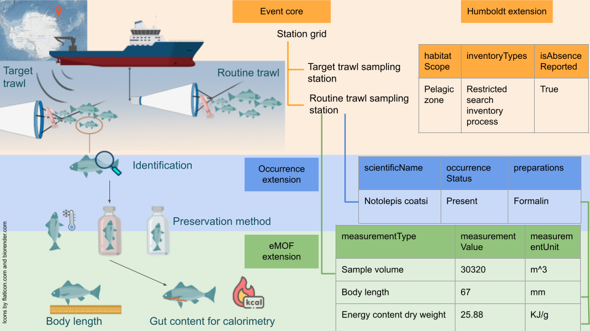

## Objectives

The objectives of this exercise are:

- to test the guiding principles in **using** the Humboldt Extension in data publication 
- to check whether the data published following the terms definition and guiding principles allow the data to be **interpreted** (infer non-detection of target taxa).


## Dataset information 

This dataset is based on the data from https://doi.org/10.1016/j.dsr2.2008.02.015 [1]
It is a dataset for testing [OBIS ENV-data structure](https://manual.obis.org/examples.html#examples-env-data-and-dna-derived-data): https://ipt.iobis.org/obis-env/resource?r=brokewest_fish
Original data is here [doi:10.4225/15/598d453109182](http://dx.doi.org/doi:10.4225/15/598d453109182)

This dataset is used as a test use case to understand how to map marine survey data to the Humboldt Extension. The mapping was done including the use of iri terms, "pretending" that this feature is available in IPT: https://github.com/gbif/ipt/issues/1947 Otherwise it's *very difficult* to parse paired pipe separated data (e.g. `eco:targetTaxonomicScope` and `eco:targetLifeStageScope`.

Tables in this dataset:

table name | description
:--|:---
event | Event core table with relevant fields from https://rs.gbif.org/core/dwc_event_2022-02-02.xml This table contains hierarchical dwc:Event structure.
occurrence | Occurrence extension table with relevant fields from https://rs.gbif.org/core/dwc_occurrence_2022-02-02.xml Each dwc:Occurrence record has an dwc:eventID that points to corresponding dwc:Event record in the `event` table.
humboldt | The Humboldt Extension table with relevant Humboldt fields from https://tdwg.github.io/hc/terms/ Each record has an dwc:eventID that points to corresponding dwc:Event record in the `event` table.
emof | The extended measurment or fact table (eMoF) with relevant eMoF fields from https://rs.gbif.org/extension/obis/extended_measurement_or_fact.xml Each record has an dwc:eventID that points to corresponding dwc:Event record in the event table. Optionally, if it is a measurement of an dwc:Occurrence record, the record also has a dwc:occurrenceID that points to a record in `occurrence` table.
target | Due to the limitation of star schema, the paired information of eco:targetLifeStageScope, eco:targetTaxonomicScope are difficult to parse. Hence I created a separate `target` table for this purpose.  

Relationships between files are depicted in figure below.



```{r, read-data, message=FALSE, warning=FALSE}
library(tidyverse)

# Get tsv files from Google Drive 
event <- read_tsv("https://docs.google.com/spreadsheets/d/e/2PACX-1vTzxqpYCe1tVdichPPMCVgP9fyY6duJrtgyO8zGwm7xMKL5WLb3l6MPq0Ke5TIlwU97ovdZ__ptkkMw/pub?gid=0&single=true&output=tsv", col_names = TRUE, show_col_types = FALSE)
occ <- read_tsv("https://docs.google.com/spreadsheets/d/e/2PACX-1vTzxqpYCe1tVdichPPMCVgP9fyY6duJrtgyO8zGwm7xMKL5WLb3l6MPq0Ke5TIlwU97ovdZ__ptkkMw/pub?gid=53360819&single=true&output=tsv", col_names = TRUE, show_col_types = FALSE)
humboldt <- read_tsv("https://docs.google.com/spreadsheets/d/e/2PACX-1vTzxqpYCe1tVdichPPMCVgP9fyY6duJrtgyO8zGwm7xMKL5WLb3l6MPq0Ke5TIlwU97ovdZ__ptkkMw/pub?gid=604710631&single=true&output=tsv", col_names = TRUE, show_col_types = FALSE)
emof <- read_tsv("https://docs.google.com/spreadsheets/d/e/2PACX-1vTzxqpYCe1tVdichPPMCVgP9fyY6duJrtgyO8zGwm7xMKL5WLb3l6MPq0Ke5TIlwU97ovdZ__ptkkMw/pub?gid=2088877587&single=true&output=tsv", col_names = TRUE, show_col_types = FALSE)
target <- read_tsv("https://docs.google.com/spreadsheets/d/e/2PACX-1vTzxqpYCe1tVdichPPMCVgP9fyY6duJrtgyO8zGwm7xMKL5WLb3l6MPq0Ke5TIlwU97ovdZ__ptkkMw/pub?gid=872194191&single=true&output=tsv", col_names = TRUE, show_col_types = FALSE)
```

## Explore dataset

Different tables used in this exercise. `emof` table is not shown. This dataset with Humboldt Extension is available at https://ipt.gbif.org/resource?r=brokewest-fish

```{r}
library(DT)
datatable(event, class = c("display", "nowrap","hover", "stripe", "order-column"), options = list(pageLength = 5, dom = 'tip'))
datatable(occ, class = c("display", "nowrap","hover", "stripe", "order-column"), options = list(pageLength = 5, dom = 'tip'))
datatable(humboldt, class = c("display", "nowrap","hover", "stripe", "order-column"), options = list(pageLength = 5, dom = 'tip'))
datatable(target, class = c("display", "nowrap","hover", "stripe", "order-column"), options = list(pageLength = 5, dom = 'tip'))
```


```{r, taxonomic-scope-complete, echo=FALSE, message=FALSE, eval=FALSE}
library(here)

# If any dwc:Organism of an dwc:Occurrence from an dwc:Event are within eco:targetTaxonomicScope, set eco:isTaxonomicScopeFullyReported to true. 

# Perform left join on humboldt and occurrence tables
taxonomic_scope_joined_table <- humboldt %>%
  left_join(occ, by = "eventID", relationship = "many-to-many") %>%
  left_join(target, by = "scientificName", relationship = "many-to-many") %>%
  group_by(eventID, isTaxonomicScopeFullyReported) %>%
  # if all dwc:Organism of dwc:Occurrence of an dwc:Event are in targetTaxonomicScope
  mutate(isTaxonomicScopeFullyReported = all(!is.na(scientificName))) %>%  
  select(eventID, isTaxonomicScopeFullyReported) %>%
  unique()

# Update the original humboldt table
humboldt$isTaxonomicScopeFullyReported <- taxonomic_scope_joined_table$isTaxonomicScopeFullyReported

# write to file
write_tsv(humboldt, file = here("data/humboldt.txt"), na ="")
```

## Visualise dwc:occurrenceStatus of presence-only dwc:Occurrence data for each dwc:Event

```{r fig.align="center", fig.height=17, fig.width=10, message=FALSE, warning=FALSE}
library(ggplot2)

occ_presence_only <- occ %>% 
  # full_join humboldt to include Event without occurrences
  full_join(humboldt, by = "eventID") %>%
  select(eventID, scientificName, occurrenceStatus) %>% 
  unique() %>% 
  # convert dwc:occurrenceStatus = present to 1, ignore individualCount or multiple occurrence of same taxa with 1 individual 
  mutate(across(everything(), ~ifelse(. == "present", 1, .))) 

# colour for labels in x-axis: target = blue, by-catch = red
target_colour <- occ_presence_only %>% 
  select(scientificName) %>% 
  unique() %>% 
  mutate(colour = ifelse(scientificName %in% target$scientificName, "blue", "red")) %>% 
  arrange(scientificName) # have to sort it based on scientificName and pass the colour to theme() in ggplot

# define custom colour-blind friendly colours (https://personal.sron.nl/~pault/#sec:qualitative) for occurrenceStatus values
color_1 <- "#0077bb"  # present

ggplot(occ_presence_only, aes(scientificName, eventID, fill = factor(occurrenceStatus))) + 
  geom_tile() +
  scale_fill_manual(
    values = color_1,
    labels = "present",
    # do not fill occurrenceStatus = NA with colours because only scientificName = NA (Event caught nothing) will have occurrenceStatus = NA
    na.translate = FALSE  
  ) +
  # rotate and right-aligned x-axis label
  theme(axis.text.x = element_text(angle = 90, hjust=0.95, vjust=0.2, colour = target_colour$colour)) +
  labs(title = "Figure 1: dwc:occurrenceStatus of presence only dwc:Occurrences")
```

Unfilled cells mean that the information of dwc:occurrenceStatus is not provided in the `occurrence` table.

## Infer non-detection of target taxa from presence-only data using Humboldt Extension

The non-detection of target taxa is inferred using the information of:

- what was detected and reported (dwc:Occurrence records)
- what was targeted (eco:targetTaxonomicScope)

For the sake of simplicity, life stages of the target taxa will not be taken into account in this exercise.

```{r create presence absence matrix, message=FALSE, warning=FALSE}
event_target_taxon_scope <- humboldt %>% select(eventID, isTaxonomicScopeFullyReported)
unique_target <- occ_presence_only %>% select(scientificName) %>% unique()

# Create combinations of eventID and scientificName of target taxa so that each eventID has EVERY target taxa in the table before occurrenceStatus is populated.
occ_presence_absence <- crossing(eventID = humboldt$eventID, scientificName = unique_target$scientificName) %>%
  # Left join with the occurrence data frame
  full_join(occ_presence_only, by = c("eventID", "scientificName")) %>%
  right_join(event_target_taxon_scope, by = "eventID") %>%
  mutate(
    occurrenceStatus = case_when(
      # keep occurrenceStatus as 1 when it is 1 (presence only data)
      occurrenceStatus == 1 ~ occurrenceStatus,
      # if occurrenceStatus = NA, scientificName is in target AND isTaxonomicScopeFullyReported = TRUE, update occurrenceStatus = 0 (inferred non-detection)
      is.na(occurrenceStatus) & scientificName %in% target$scientificName & isTaxonomicScopeFullyReported ~ 0,
      # else, leave it as NA (cannot infer non-detection when isTaxonomicScopeFullyReported is FALSE)
      TRUE ~ NA
    )
  )
```

### Visualise presence and inferred non-detection of target taxa per dwc:Event

```{r fig.align="center", fig.height=17, fig.width=10, message=FALSE, warning=FALSE}
# colour target = blue, by-catch = red
target_colour <- occ_presence_absence %>% 
  select(scientificName) %>% 
  unique() %>% 
  mutate(colour = ifelse(scientificName %in% target$scientificName, "blue", "red")) %>% 
  arrange(scientificName) # have to sort it based on scientificName and pass the colour to theme() in ggplot

# define custom colour-blind friendly colours (https://personal.sron.nl/~pault/#sec:qualitative) for occurrenceStatus values 1, 0 and NA
color_1 <- "#0077bb"  # present, occurrenceStatus = 1
color_0 <- "#ee7733"  # absent, occurrenceStatus = 0
color_na <- "#bbbbbb"  # NA, occurrenceStatus = NA

ggplot(occ_presence_absence, aes(scientificName, eventID, fill=factor(occurrenceStatus))) + 
  geom_tile() +
  scale_fill_manual(
    values = c(color_0, color_1),
    labels = c("absent", "present", "cannot be inferred"),
    na.value = color_na
  ) +
  # rotate and right-aligned x-axis label
  theme(axis.text.x = element_text(angle = 90, hjust=0.95, vjust=0.2, colour = target_colour$colour)) +
  labs(title = "Figure 2: Inferred non-detection of target taxa using presence-only data")
  
```

The `dwc:scientificName` in <span style="color: red;">red</span> are `dwc:Organism` caught during the `dwc:Event`, but are not within the `eco:targetTaxonomicScope` (by-catch); the ones in <span style="color: blue;">blue</span> are within the `eco:targetTaxonomicScope`. In other words, in this dataset, the `target` is the thing the researchers intended to catch using the sampling design. By-catch are not part of the `eco:targetTaxonomicScope` so its non-detection cannot be inferred. 

## Thoughts

Some of my thoughts and questions

### 1. Should `eco:isTaxonomicScopeFullyReported` be true/false/null if an dwc:Event is **not** associated with any dwc:Occurrence?

In this dataset, every observations were reported. `eco:isTaxonomicScopeFullyReported` is defined as

> Every dwc:Organism that was included within the taxonomic scope, and was detected during the dwc:Event, was reported.

I am slightly confused about how to populate `eco:isTaxonomicScopeFullyReported` if an dwc:Event is not associated with dwc:Occurrence. If `eco:isTaxonomicScopeFullyReported` is `false`, then the non-detection of targets cannot be inferred. Hence, I set `eco:isTaxonomicScopeFullyReported` to `true`


### 2. eco:targetLifeStageScope and eco:excludedLifeStageScope SHOULD be explicit 

In order for users to be able to infer non-detection of target taxa up to life stage level, values for `eco:targetLifeStageScope` and `eco:excludedLifeStageScope` MUST be explicit and specific. **All out** approach of listing **every single life stage** should be used instead of using `all` for these two fields. Similarly, it should be explicit when `none` is the value instead of leaving the field blank. 

This is because users cannot confidently infer non-detection of taxa to life stages level if there is only `eco:targetLifeStageScope` without explicit `eco:excludedLifeStageScope` (or vice verse) because life stages are specific to taxa. Different vocabularies can have different definitions. However, guidance to fill in these two fields when none _should_ be the value is lacking.

### 3. Do I need to have a target list _before_ a survey? Can I construct the target list _after_ the identification of the dwc:Organism?

If I understand correctly, Anton does not have a *very clear* list of species before the expedition. He has some idea (up to family and life stage) of what is expected to be caught. Does it make sense to put the family (e.g. [_Myctophidae_](https://www.gbif.org/species/4217)) in the `eco:targetTaxonomicScope` when the effort expanded should be targeting taxa that can occur there within the spatiotemporal scope where some of the species from the family _Myctophidae_ will not present? This seems to widen the scope of `eco:targetTaxonomicScope`.

The target list here was constructed _after_ the survey, based on what was caught. Everything caught was identified and reported. Hence this list is _very_ specific and allows non-detection to be inferred to species level. However, **not** everything caught is reported in this dataset. Krills are identified and reported by a different group of people in a [separate dataset](https://data.aad.gov.au/metadata/records/BROKE-West_RMT_krill). 

### 4. Distinguishing by-catch-only dwc:Event and dwc:Event that sampled nothing

I do not know how to document and distinguish the Event where by-catch were caught but **not reported** and Event which caught nothing. There is no dwc:Event that caught by catch but not reported in this dataset, but a thought that this might happen.

### 5. How definition of `target` may affect how inference of non-detection of `target` can be made

In this dataset, by-catch is not listed in the `target` table, meaning that they are not part of `eco:targetTaxonomicScope` and `eco:lifeStageScope`. My reasoning is the sampling design and effort expanded were **intended** to sample these `targets`. Since they are not in `eco:targetTaxonomicScope`, `eco:isTaxonomicScopeFullyReported` does not apply to the by-catch and hence we cannot infer their non-detection in all dwc:Events.

IF, by-catch is to be included in targets (e.g. `eco:targetTaxonomicScope`), `eco:isTaxonomicScopeFullyReported` can be applied to these taxa. The definition of `target` will then be what the sampling design and effort expanded **CAN** catch instead of what is **INTENDED** to be sampled.

### 6. Limitations of star schema

#### 6.1 Limiting the scope that can be inferred 

Each taxon in `eco:targetTaxonomicScope` can be associated with multiple target life stage scope in `eco:targetLifeStageScope`. However, `eco:isLifeStageScopeFullyReported` can only be reported at dwc:Event level instead of per target taxon. Different taxa are often identified by different people, so there could be different reporting practices. 

#### 6.2 Concept of taxon represented by `dwc:scientificName` in `eco:targetTaxonomicScope` cannot be fully expressed

The lack of identifiers for `dwc:scientificName` in `eco:targetTaxonomicScope` may be problematic for [homonyms](https://discourse.gbif.org/t/millipedes-in-the-ocean/3991) (or more). 

If a target taxon in `eco:targetTaxonomicScope` has `dwc:taxonRank` == genus, it means _every_ species of the genus is targeted. If this was the intent, then an external identifier should perhaps be provided to point to the taxon concept it refers to. The concept should perhaps have a version snapshot. Otherwise, how can one know _what_ species there are under this genus at the time of the dwc:Event? Can a user infer non-detection of the target taxa up to species level if only genus of target taxa is specified in `eco:targetTaxonomicScope`? Is this a good practice?

### 7. Difference in number of records for dwc:Occurrence when non-detection is explicit vs when it is presence-only (non-detection can be inferred)

```{r}
nrow(occ_presence_absence)  
nrow(occ)  # there can be multiple occurrences of SAME taxon per event because the occurrenceID is needed for individual length measurement of the fish
nrow(occ_presence_absence) - nrow(occ)
```


## Acknowledgement

We would like to thank Anton Van de Putte for kindly allowing us to use his dataset to test the extension and the time spend in helping us to understand his data.


## Bibliographic citation

1. Van de Putte, A.P.; Jackson, G.D.; Pakhomov, E.; Flores, H.; Volckaert, F.A.M. (2010). Distribution of squid and fish in the pelagic zone of the Cosmonaut Sea and Prydz Bay region during the BROKE-West campaign. Deep-Sea Res., Part 2, Top. Stud. Oceanogr. 57(9-10): 956-967. [dx.doi.org/10.1016/j.dsr2.2008.02.015](https://doi.org/10.1016/j.dsr2.2008.02.015) 
2. van de Putte, A. (2010) Fish catches from Rectangular Midwater Trawl - data collected from the BROKE-West voyage of the Aurora Australis, 2006, Ver. 1, Australian Antarctic Data Centre - [doi:10.4225/15/598d453109182](http://dx.doi.org/doi:10.4225/15/598d453109182), Accessed: 2023-08-07


